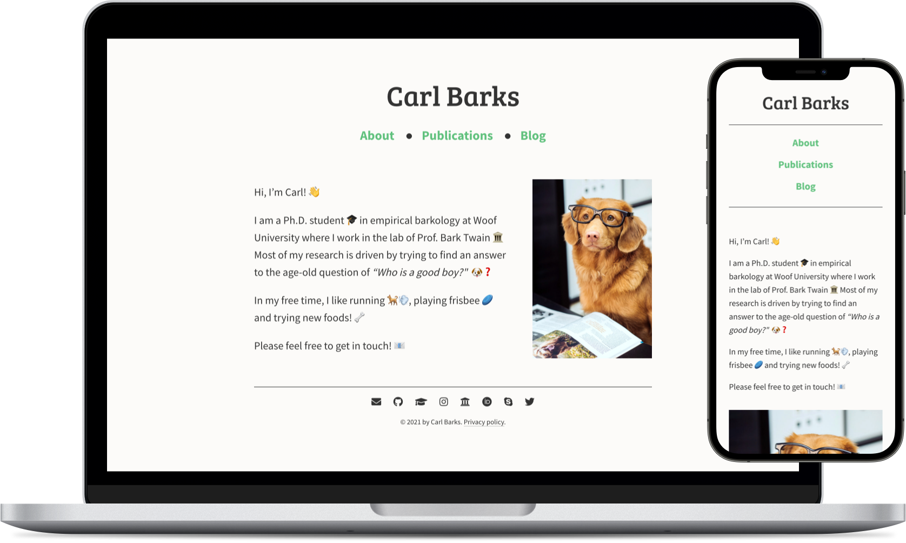

<h1 align="center">barks</h1>

**barks** is a simple, minimalistic theme for the static website generator [Hugo](https://gohugo.io). Its was primarily developed as a theme for personal (academic) websites, although it may also be useful for other purposes 🙃


<br>

<p align="center">
  
</p>
<br>

## 🚀 Live Demo

A live demo that showcases **barks** in action is available [here](https://timothygebhard.de/projects/barks).

<br>

## ⚡️ Quickstart

If you already have a Hugo site, you can use **barks** as your theme by calling:

```bash
git submodule add https://github.com/timothygebhard/barks
```

in your `themes` directory, and changing the `theme` parameter in your `config.toml` to `"barks"`.

Otherwise, you might want to check out the [Hugo quickstart guide](https://gohugo.io/getting-started/quick-start/).

**Note:** Since *barks* makes use of [SCSS](https://en.wikipedia.org/wiki/Sass_(stylesheet_language)), which needs to be pre-compiled, you need to make sure that you are using the [extended version](https://gohugo.io/troubleshooting/faq/#i-get--this-feature-is-not-available-in-your-current-hugo-version) of Hugo!

<br><br>

## 📄 Layout for landing page

If you want to use the landing page as shown in the screenshot above, put `layout: landing_page` into the header of your `_index.md` file.  Additionally, you need to add `image: <image_url>` to specify the image that should be used.

<br><br>

## ⚙️ Configuration

**barks** comes with a number of customization options to personalize its looks through the `[params]` section in the `config.toml` file. Most options should be rather self-explanatory; nevertheless, here is a quick overview:

<br>

**Head:**

You can add information about the author, a description and some keywords (all of which will be used to generate `<meta>` tags in the `<head>` ) in the `[params.head]` section. Additionally, you can also specify the path to a custom CSS file in which you can change the stylesheets of **barks** or add new styles:

```toml
[params.head]
    author = "Carl Barks"
    custom_css = "<url_to_custom_css_file>"
    description = "Hi, I'm Carl, and this is my website!"
    keywords = ["some", "keywords", "to", "describe", "this"]
```

<br>

**Navigation and footer:**

You can disable the navigation (e.g., if all your content fits onto a single page) and the footer (e.g., if you don’t need the social media icons or a copyright notice) using:

```toml
[params.navigation]
    show_navigation = false

[params.footer]
    show_footer = false
```

Set these values to `true` (or omit them altogether) if you *do* want to use the navigation and the footer.

<br>

**Typography:**

You can choose the font for the website title (i.e., the header), as well as the main text using:

```toml
[params.typography]
    title_font = "Bree Serif"
    body_font = "Source Sans Pro"
```

You can use *any* [Google Font](https://fonts.google.com/) here; **barks** will load them automatically.

<br>

**Colors:**

Change the colors of the [theme](https://developer.mozilla.org/en-US/docs/Web/HTML/Element/meta/name/theme-color), the background, the text, and the links in the navigation using:

```toml
[params.colors]
    theme_color = "#333333"
    background_color = "#fcfbf9"
    text_color = "#333333"
    link_color = "#60c17d"
```

<br>

**Social media:**

You can add your social media profiles and contact options to the footer via the `[params.social]` section. Here is an example of how this might look:

```toml
[params.social]
    [params.social.email]
        name = "E-Mail"
        class = "fas fa-envelope"
        url = "mailto:<your_name>@<your_institution>.com"
        weight = 1
    [params.social.github]
        name = "GitHub"
        class = "fab fa-github"
        url = "https://github.com/<your_github_username>"
        weight = 2
    [params.social.google_scholar]
        name = "Google Scholar"
        class = "ai ai-google-scholar-square"
        url = "https://scholar.google.com/citations?user=<your_user_id>"
        weight = 3
```

As you can see, each entry in the `[params.social]` section is itself a section with 4 keys:

* `name`: This will be used for the `title` attribute of the link (which is what you see in the little pop-up if you place your cursor on the link).
* `class`: This field controls which icon is used. You can use *any* icon from [FontAwesome](https://fontawesome.com/) or [Academicons](https://jpswalsh.github.io/academicons/). The icons are included as `<i class="[class]"></i>`; see the [FontAwesome manual](https://fontawesome.com/v5.15/how-to-use/on-the-web/referencing-icons/basic-use) for more information.
* `url`: The URL to your profile for the respective platform. For e-mail addresses, add a `mailto:` [prefix](https://en.m.wikipedia.org/wiki/Mailto).
* `weight`: Use this field to define the order by which the icons are sorted.

<br>

**Disabling page titles:**

By default, each page prints the `title` that is specified in the header as a `<h1>`-level heading at the top of the page. You can disable this for any given page by adding `hide_title: true` to the header.

<br><br>

## 🤓 LaTeX support

You can enable LaTeX support (via [KaTeX](https://katex.org/)) by adding `math: true` to the header section of each page or post in which you want to use it. (That way the corresponding JS is only loaded when it is needed.)

Use single dollar signs `$` for inline formulas, and double dollar signs `$$` for typesetting math in a block.

<br>

## 🦄 Contributing

Direct contributions and pull requests to improve **barks** are always welcome! Otherwise, you can of course also help the development by creating issues for bugs that you have encountered, or for new features that you would like to see implemented 🙃

<br>

## ⚖️ License

**barks** is released under the [MIT license](https://opensource.org/licenses/MIT); see [LICENSE](https://github.com/timothygebhard/barks/blob/main/LICENSE) file.
